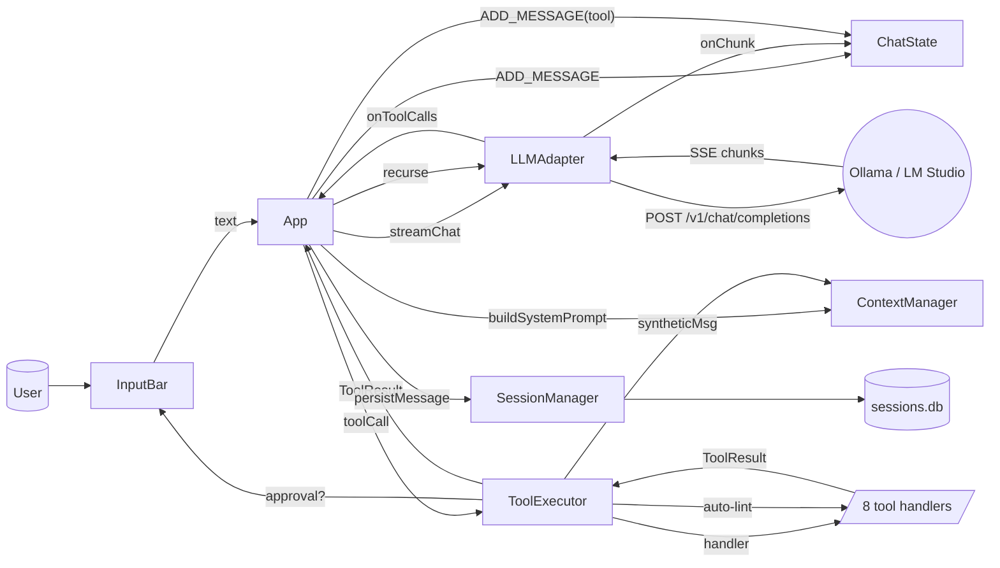
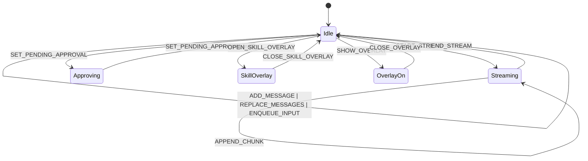
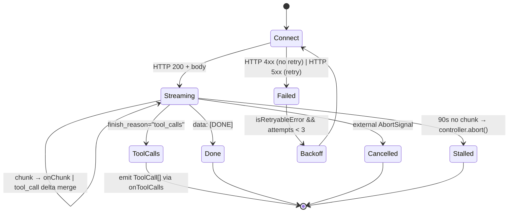

# Architecture

LocalCode is a single-process Bun + ink app. The composition root
(`src/app.tsx`) wires every concrete service into the screen tree.
Every other module is dependency-light; tests inject fakes by passing
options to constructors.

## Module map

```
src/
├── cli.tsx                # argv parsing + ink render(), exit banner
├── app.tsx                # composition root — wires services to screens
│
├── config/
│   ├── defaults.ts        # DEFAULT values + per-backend URLs / num_ctx
│   ├── types.ts           # Zod ConfigSchema + AppConfig structural assertion
│   └── config-manager.ts  # TOML read/write, deep-merge update, atomic rename
│
├── llm/
│   ├── adapter.ts         # OpenAI-compat HTTP client (LM Studio + Ollama)
│   ├── context-manager.ts # message buffer + system prompt + summarization
│   ├── streaming.ts       # SSE frame split + Harmony-token filter
│   ├── tool-executor.ts   # approval gating + auto-lint post-commit hook
│   └── tools-schema.ts    # OpenAI-style function schemas for the 8 tools
│
├── tools/
│   ├── read-file.ts       # 100KB cap, traversal block
│   ├── write-file.ts      # 2-phase: preview diff → commit
│   ├── edit-file.ts       # 2-phase: search/replace, uniqueness checked
│   ├── run-command.ts     # 2-phase: preview → execa('sh', ['-c', ...])
│   ├── list-dir.ts        # depth ≤ 5, gitignore-aware
│   ├── glob-search.ts     # fast-glob, ≤ 100 results
│   ├── fetch-image.ts     # HTTP(S)/data: URI → base64, ≤ 10MB
│   ├── lint-file.ts       # tsc / ruff / go vet / rustc dispatch
│   ├── types.ts           # ToolContext, per-tool arg shapes
│   └── index.ts           # createToolHandlerMap()
│
├── commands/
│   ├── slash-registry.ts  # name → SlashCommand registry
│   ├── cmd-init.ts        # /init  — generate LOCALCODE.md via the LLM
│   ├── cmd-model.ts       # /model — switch / open ModelSelectScreen
│   ├── cmd-resume.ts      # /resume — overlay or imperative loader
│   ├── cmd-context.ts     # /context — token usage + skills + system prompt
│   ├── cmd-clear.ts       # /clear — summarise then reset chat
│   ├── cmd-permissions.ts # /permissions — overlay or `add/remove/clear`
│   ├── cmd-ctxsize.ts     # /ctxsize  — overlay or `<N>` / `keepalive <s>`
│   ├── cmd-new-skill.ts   # /new-skill — opens SkillInputOverlay
│   ├── cmd-provider.ts    # /provider — overlay or `ollama/lmstudio/custom`
│   └── index.ts           # registerBuiltinCommands() barrel
│
├── sessions/
│   ├── db.ts              # bun:sqlite singleton + schema + migrations
│   └── session-manager.ts # CRUD over sessions/messages tables
│
├── skills/
│   ├── skill-parser.ts    # zero-dep frontmatter parser
│   └── skills-manager.ts  # two-source loader (project ▶ global)
│
├── init/
│   ├── project-scanner.ts # tree + key files for /init prompt
│   ├── localcode-md.ts    # writes .localcode/LOCALCODE.md, .gitignore
│   └── gitignore-parser.ts# minimal gitignore matcher
│
├── integration/
│   ├── chat-state.ts      # ChatState reducer (≈ 17 actions)
│   └── sound.ts           # SoundPlayer (afplay/aplay/bell)
│
├── ui/
│   ├── theme.ts           # Nox purple palette + chalk wrappers
│   ├── screens/           # OnboardingScreen / ChatScreen / SkillsScreen / ModelSelectScreen
│   └── components/        # Header, InputBar, MessageBlock, overlays, Nox, etc.
│
└── types/
    ├── global.d.ts        # Backend, AppConfig, Message, Skill, etc.
    └── message.ts         # WireMessage, StreamChatParams, KNOWN_TOOL_NAMES
```

## High-level data flow



A normal turn:

1. User types into `InputBar` and presses `Enter`.
2. `App.onSubmit` either dispatches `ADD_MESSAGE` immediately or
   `ENQUEUE_INPUT` if a stream is in flight (FIX #6).
3. `App.runStreamLoop` builds a fresh system message via
   `ContextManager.buildSystemPrompt({ localcodeMd, skills, summary })`.
4. `LLMAdapter.streamChat` opens a POST against
   `/v1/chat/completions` with `stream_options.include_usage = true`.
5. `streaming.HarmonyFilter` strips `<|channel|>`, `<|message|>`, and
   `<|start|>` tokens (FIX #1).
6. Per-chunk text → `chatDispatch APPEND_CHUNK`. Final chunk's `usage`
   → `recordUsage` + `ADD_OUTPUT_TOKENS`.
7. If `finish_reason === "tool_calls"`, the accumulator emits
   `ToolCall[]`. `App.runStreamLoop` then iterates each call:
   - `ToolExecutor.execute(call)` — gates approval (`approvalCallback`
     resolves a UI promise → `PendingApproval`), dispatches to the
     handler, fires the post-commit hook (auto-lint, FIX #27).
   - The result becomes a `tool`-role message added to context and
     persisted, then the loop **recurses** (`runStreamLoop()`) so the
     model can continue with the tool output.
8. When a stream ends without tool calls, the assistant message is
   persisted with `tokensInput`, `tokensOutput`, `durationMs` and the
   `UsageFooter` reads those numbers.

## ink render tree

```
<App>
├─ <OnboardingScreen>           # only on first run / --reconfigure
├─ <SkillsScreen>               # /skills
├─ <ModelSelectScreen>          # /model (no args)
├─ <ProviderOverlay>            # full-frame; on /provider
└─ <ChatScreen>                 # everything else
   ├─ <MessageBlock> ×N         # rendered messages (+ inline diffs)
   ├─ <ToolCallBlock>           # tool ▶ args ▶ result rendering
   ├─ <Nox> (Big or Mini)       # mascot — splash, blink, scrolls up
   ├─ <ThinkingSpinner> + <ThinkingPhrases>   # rotating phrases
   ├─ <ApprovalPrompt>          # appears when pendingApproval is set
   ├─ <UsageFooter>             # ↳ N→M tokens · d.dms · session: Nt
   ├─ <InputBar>                # bordered, ↑/↓ history, queued indicator
   ├─ <SlashMenu>               # opens on `/`
   ├─ <SkillInputOverlay>       # /new-skill
   └─ overlay = OverlayState    # Permissions / Context / CtxSize / Resume
```

## Chat-state reducer

The reducer (`src/integration/chat-state.ts`) is pure and exhaustively
typed — `tests/integration/chat-state*.test.ts` covers every action.



`overlayKind` is *preserved* across `ADD_MESSAGE`, `START_STREAM`,
`APPEND_CHUNK`, etc. — only `RESET` and `CLOSE_OVERLAY` clear it.

## LLM adapter state machine



Retries are 1 s / 2 s / 4 s exponential. Only network/DNS/5xx errors
retry; 4xx fails fast. Stall timeout is 90 s — long enough for cold
loads, short enough to surface a hung backend.

## Session storage

`bun:sqlite` opened at `~/.localcode/sessions.db`. WAL journal mode for
files; `MEMORY` journal for `:memory:` tests.

```sql
CREATE TABLE sessions (
  id TEXT PRIMARY KEY,
  created_at INTEGER NOT NULL,
  updated_at INTEGER NOT NULL,
  project_root TEXT NOT NULL,
  title TEXT,
  model TEXT NOT NULL,
  backend TEXT NOT NULL,
  summary TEXT             -- compressed text injected on /resume
);

CREATE TABLE messages (
  id TEXT PRIMARY KEY,
  session_id TEXT NOT NULL REFERENCES sessions(id),
  role TEXT CHECK(role IN ('user','assistant','tool','system')),
  content TEXT NOT NULL,
  tool_name TEXT,
  tool_args TEXT,          -- JSON for assistant.toolCalls; toolCallId for tool rows
  created_at INTEGER NOT NULL,
  tokens_input INTEGER,
  tokens_output INTEGER,
  duration_ms INTEGER
);

CREATE INDEX idx_messages_session ON messages(session_id, created_at);
```

Migrations live in `src/sessions/db.ts`'s `MIGRATIONS` array. Adding a
new column means appending one `ALTER TABLE …`; the helper swallows
"duplicate column" errors so the same migration is safe on a fresh DB.

## Two-source skills

`SkillsManager` walks both directories and dedupes by id with project
winning. Watched dirs are surfaced as `projectDirectory` and
`globalDirectory` so `app.tsx` can register a single `chokidar.watch`
on both. The active-state JSON sits next to the writable directory
(project-local when a project root is supplied, otherwise global).

## Streaming filter

`HarmonyFilter` (`src/llm/streaming.ts`) suppresses Harmony-channel
markers (`<|channel|>`, `<|message|>`, `<|start|>`) that some
fine-tuned models emit. It's a tail-buffered state machine: the worst
case "almost-a-marker" suffix is buffered, the rest is flushed.

## Composition map (where things plug in)

| Concern | Owner |
| --- | --- |
| First-run config write | `OnboardingScreen` → `App.onOnboardComplete` → `ConfigManager.write` |
| Resume by id prefix | `cli.tsx --resume` → `App.useEffect → SessionManager.getSession` + prefix scan |
| Slash → overlay | `App.onSlashExecute` → `cmd.execute(args, ctx)` → `ctx.showOverlay(kind)` → `chatDispatch SHOW_OVERLAY` |
| Approval prompt | `ToolExecutor.approvalCallback` → `pendingResolverRef` Promise → `ApprovalPrompt` `onApprove`/`onReject` |
| Adapter rebuild on `/provider` | `App.onProviderApply` → `configManager.update` → `llm` memo deps change → old controller aborted, new adapter built |
| Auto-lint after write | `ToolExecutor.postCommitHook` → `lint_file` handler → synthetic Message → `onAutoCheckResult` → `contextManager.add` + `chatDispatch ADD_MESSAGE` |
| Resume summary | `App.summariseAndPersistOutgoing` → `contextManager.generateSummary` → `sessionManager.updateSummary` |

## What is NOT in the runtime

LocalCode deliberately ships without:

- A web UI. ink + bun-only by design.
- Out-of-process tool sandboxes. `run_command` shells out via `execa`
  and trusts the local FS. Approval prompts are the safety boundary.
- Cloud telemetry. The only outbound traffic is to your configured
  backend URL (and `fetch_image` to the URL the model requests).
- A migration framework. The DB has at most 4 columns added since v0;
  raw `ALTER TABLE` plus duplicate-column tolerance is enough.

For the planned-but-not-shipped surface, see
[ROADMAP.md](ROADMAP.md).
